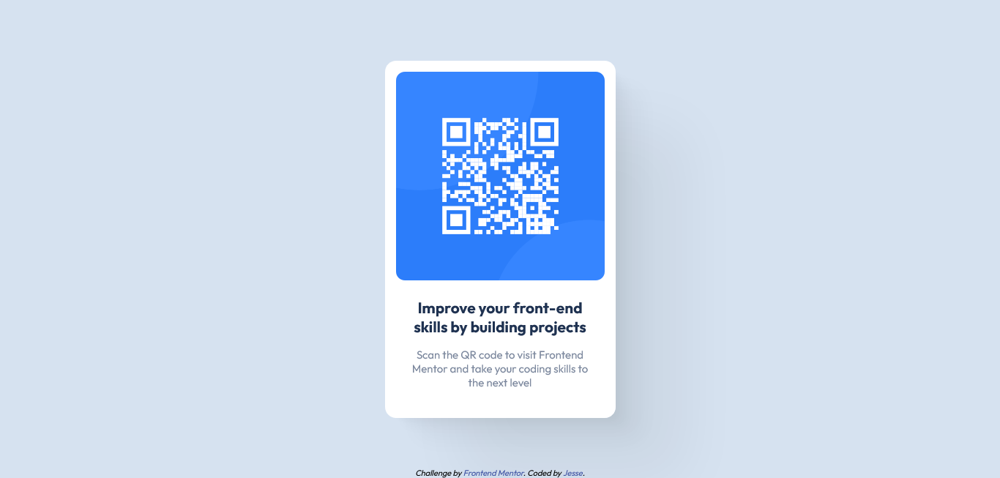

# Frontend Mentor - QR code component solution

This is a solution to the [QR code component challenge on Frontend Mentor](https://www.frontendmentor.io/challenges/qr-code-component-iux_sIO_H). Frontend Mentor challenges help you improve your coding skills by building realistic projects. 

## Table of contents

- [Overview](#overview)
  - [Screenshot](#screenshot)
  - [Links](#links)
- [My process](#my-process)
  - [Built with](#built-with)
  - [What I learned](#what-i-learned)
  - [Continued development](#continued-development)
  - [Useful resources](#useful-resources)

## Overview

### Screenshots

- Mobile view: 

- Desktop view: 

### Links

- Solution URL: [Add solution URL here](https://your-solution-url.com)
- Live Site URL: [Add live site URL here](https://your-live-site-url.com)

## My process

### Built with

- Semantic HTML5 markup
- CSS custom properties
- Flexbox
- Mobile-first workflow

### What I learned

I used the flex-gap property for the first time. It ensures that all the components added to the text section of the card in the future will have equal spacing between them. 

I practiced vertically and horizontally centering elements using flexbox. 

I used the width and max-width properties together to ensure that the card looks good on every screen size without having to use media queries. 

### Continued development

In the future, I would like to focus on creating responsive web pages while using as few media queries as possible. 

### Useful resources

- CSS Tricks (https://css-tricks.com/centering-css-complete-guide/) - CSS Tricks provided a very easy to understand guide for centering elements. Their articles are well written in general.

